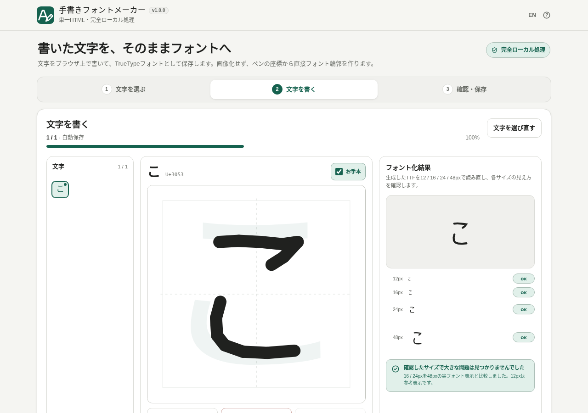

# Handwriting Font Maker / 手書きフォントメーカー

[](https://github.com/ttomohisa/htmlapps-handwriting-font-maker/actions/workflows/deploy-pages.yml)
[](LICENSE)
[](https://ttomohisa.github.io/htmlapps-handwriting-font-maker/)

[English README](README.md)

ブラウザ上で文字を書き、その手書きからTrueTypeフォント（TTF）を作成するツールです。文字の入力データは画像へ変換せず、ペン座標をベクターデータとして保持したままフォント化します。

生成したTTFを12 / 16 / 24 / 48pxで実際に読み直して確認できます。16 / 24pxでは48pxと比べて形が結合・消失した場合を中心に「要確認」とし、12pxは参考表示として扱います。書いた文字や生成するフォントは外部へ送信せず、ブラウザ内で処理します。

## デモ

### [GitHub Pagesで開く](https://ttomohisa.github.io/htmlapps-handwriting-font-maker/)

[](https://ttomohisa.github.io/htmlapps-handwriting-font-maker/)

## 主な機能

- サイズ別の字形チェック: 16 / 24pxの実フォントを48pxと比較して形の変化を確認します。12pxは参考表示です。
- お手本文字は実際の字形サイズを測って表示し、日本語・英字・数字で大きさが極端に変わらないようにします。
- ひらがな、カタカナ、英大文字、英小文字、数字、記号から文字セットを選択
- 入力した文章から必要な文字だけを抽出
- マウス、タッチ、ペンで1文字ずつ入力
- ストローク単位のUndo / Redo（消去後の安全な取り消しと、復元時の点数上限チェック）
- ペンの太さ調整
- 現在の文字を薄く表示する「お手本」ガイド（ON / OFF、状態を自動保存）
- 書いた座標を1000×1000の論理座標でベクター保持
- ラスター画像化・二値化・画像輪郭トレースを行わずにTrueType輪郭を生成
- 生成したTTFを `FontFace` で読み込み、実フォントとしてプレビュー
- フォント名と出力ファイル名を編集してTTF保存
- 作業内容をブラウザ内へ自動保存
- フォント生成中や生成失敗時でも、書く画面でファイル名を編集して `.handfont.json` を保存し、あとから読み込んで再開
- 文字選択から外した文字の手書きも保持し、再選択すれば編集を再開
- 入力済み数と割合を示す進捗バー
- 必要なときに次の未入力文字・要確認文字へ直接移動
- 文字一覧を「すべて / 未入力 / 要確認」で絞り込み（PCとスマートフォンの文字一覧で選択を共有）
- ヘッダーのEN / JAで日本語・英語を切替（切替先の説明とヘルプも各言語で表示）
- PC / スマートフォン対応
- 通常版と自己解凍版の単一HTMLを生成

## 使い方

1. フォント名を入力します。
2. 作りたい文字セットを選ぶか、「使いたい文字だけ」に文章を入力します。
3. **文字を書き始める** を押します。
4. 薄いお手本文字を参考に、ガイド内へ現在の文字を書きます。お手本は必要に応じてON / OFFできます。
5. 前後の文字や文字一覧から移動し、必要な文字を書いていきます。**すべて / 未入力 / 要確認** で一覧を絞り込めます。対象文字や順番は変わりません。PCとスマートフォンで同じ絞り込みを使い、作業データや自動保存には記録しません。進捗バーは常にプロジェクト全体の入力済み数を示します。
6. 右側（スマートフォンでは描画欄の下）のプレビューで、実際に生成されたフォントを確認します。各行に **OK / 参考 / 要確認** が表示されます。12pxだけ細部が変わる場合は「参考」とし、全体の要確認件数には含めません。
7. 最後の文字では、未入力が残っていればそこへ戻り、すべて入力済みなら **確認・保存** へ進みます。ファイル名を確認して **TTFを保存** を押します。

書く画面の **編集用データを保存** から、途中の内容をいつでもバックアップできます。ボタンの近くでファイル名を編集でき、TTF出力と共通の名前に `.handfont.json` が付きます。TTFの生成完了を待つ必要はありません。現在の文字選択から外した文字の手書きも、作業データと自動保存に残ります。再選択すれば編集を再開でき、TTFには現在選択している文字だけが含まれます。作業データを文字選択画面から読み込むと、別の端末でも続けられます。ブラウザ内の自動保存は、ブラウザデータの削除や使用ブラウザの変更で失われる場合があるため、作業データの明示保存をおすすめします。

TTFは、入力済みの文字が1つ以上あり、現在の手書き・線の太さ・フォント名に対応するフォントを正常に読み込めた場合だけ保存できます。編集すると古いTTFはすぐに保存対象から外れます。遅れて完了した古い生成結果が、編集後や作業データの切り替え後に保存可能になることはありません。

### フォント表示の再試行

フォント生成に失敗したときは、プレビューの状態表示の横にある「フォント表示を再試行」を押せます。選択中の文字一覧に手書きの線があれば、現在の文字が未入力でも再試行できます。失敗時の字形カードは「字形を確認できません」、各サイズは「未確認」と表示され、字形の品質警告には数えません。書いた線や編集状態は保持され、再試行中も「編集用データを保存」でバックアップできます。自動では再試行しません。

## 文字がつぶれにくいようにする方針

このアプリでは、書いた文字をいったん画像へ変換してから輪郭を再検出する方式を採用していません。

```text
Pointer入力
  ↓
ベクターのストローク座標
  ↓
ベクター輪郭
  ↓
TrueType glyf
  ↓
TTF
```

v1.0.0では、1本のペン線から可能な限り1つの連続輪郭を作ります。生成した輪郭が自己交差するような複雑な線では、v0.1.0の丸み付き分割輪郭へ自動的にフォールバックします。

無理なBoolean Unionや強い単純化はまだ行いません。細い隙間を消してしまう可能性がある処理は、回帰テストとTopology保護を用意してから段階的に追加します。

## 制限・注意事項

- 出力はTTFのみです。WOFF2には対応していません。
- 文字ごとの高度な字幅調整、カーニング、リガチャーには未対応です。
- 複数の字形をランダムに切り替える機能はありません。
- 画像や紙テンプレートからの取り込みには対応していません。
- Unicode U+10000以上の文字には未対応です。
- 選択中の文字と、選択から外れていても手書きを保持している文字を合わせて最大180文字、点数は合計80,000点です。文字選択の変更で合計上限を超える場合は、手書きを削除せず変更を止めます。
- ストローク間のBoolean Unionや高度なBezier最適化は意図的に行っていません。複雑な1ストロークは安全な分割輪郭へ戻します。

## プライバシー

**完全ローカル処理**です。

- 書いた文字や座標をサーバーへ送信しません。
- フォント生成はブラウザ内で行います。
- CDN、外部API、解析タグ、テレメトリを実行時に使用しません。
- CSPは `connect-src 'none'` とし、実行時ネットワーク接続を禁止しています。
- 自動保存データはブラウザのローカルストレージに保存します。

GitHub Pagesで利用する場合、最初にページ本体を取得する通信は発生します。ページ読み込み後のフォント作成処理には外部通信を必要としません。

## 対応ブラウザ

主な対象は最新版の以下です。

- Google Chrome
- Microsoft Edge

Firefox / Safari / iOS Safariでは、利用する標準Web APIの実装差により挙動が異なる場合があります。主要な動作確認対象はChrome / Edgeです。

## 開発

ソース本体は `src/index.template.html` です。`dist/` とルートのダウンロード用 `handwriting-font-maker.html` は生成物なので直接編集しません。

### Windowsでビルド

```bat
build-standalone.bat
```

生成物:

```text
dist/
├─ index.html
├─ index.self-extract.html
├─ dependency-manifest.json
├─ build-size-report.json
├─ self-extract-manifest.json
└─ .nojekyll
```

通常ビルドでは、ルートの `handwriting-font-maker.html` も `dist/index.html` とバイト単位で一致する内容へ更新します。どちらの通常版HTMLも直接 `file://` で開ける構成です。`-OutputPath` を指定した別出力のビルドでは、ルートのダウンロード用HTMLを変更しません。

### リポジトリ検証

PowerShellとNode.js 20以降を用意して実行します。

```powershell
powershell.exe -NoLogo -NoProfile -ExecutionPolicy Bypass -File .\scripts\check-repository.ps1
```

通常版・自己解凍版をビルドして検証し、追加パッケージ不要の手書き動作・配布物の回帰テストと、ルートのダウンロード用HTMLの完全一致チェックを行います。既存のCIも同じ検証を実行します。ビルドし直さず配布物の一致だけを確認するには `node scripts/test-packaging.cjs --verify-output` を使います。ルートのHTMLが古い場合や存在しない場合は失敗します。

### 外部依存

アプリ本体にサードパーティーのランタイム依存はありません。`dependencies.json` と `dependencies.lock.json` は空です。

## 今後の候補

- WOFF2出力
- 複数字形
- より細かな字間調整

詳細は [APP_SPEC.md](APP_SPEC.md) を参照してください。

## License

MIT License. See [LICENSE](LICENSE).
