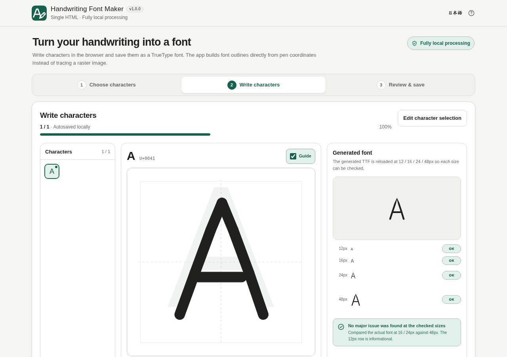

# Handwriting Font Maker

[](https://github.com/ttomohisa/htmlapps-handwriting-font-maker/actions/workflows/deploy-pages.yml)
[](LICENSE)
[](https://ttomohisa.github.io/htmlapps-handwriting-font-maker/)

[日本語版 README](README.ja.md)

Handwriting Font Maker creates a TrueType font from characters you draw directly in the browser. It keeps pen coordinates as vector data instead of rasterizing the handwriting and tracing it back into outlines.

The generated TTF is reloaded at 12 / 16 / 24 / 48px for direct inspection. Review warnings focus on actual shape changes at 16 / 24px compared with 48px, while 12px is treated as an informational reference. Handwriting and generated font data stay in the browser and are not uploaded.

## Demo

### [Open on GitHub Pages](https://ttomohisa.github.io/htmlapps-handwriting-font-maker/)

[](https://ttomohisa.github.io/htmlapps-handwriting-font-maker/)

## Features

- Size-by-size glyph check: compares actual rendered shape at 16 / 24px against 48px; 12px is displayed as an informational reference.
- Guide character fitted by actual glyph bounds so Japanese, Latin, and digits appear at a consistent visual size.
- Select hiragana, katakana, uppercase/lowercase Latin, digits, and common symbols
- Extract only the unique characters needed from custom text
- Draw one character at a time with mouse, touch, or pen
- Stroke-level Undo / Redo, with safe Clear undo and the project point limit enforced on restoration
- Adjustable pen width
- Toggleable faint guide character, with the preference included in local autosave
- Keep handwriting in normalized 1000×1000 vector coordinates
- Generate TrueType outlines without rasterization, thresholding, or image contour tracing
- Load the generated TTF through `FontFace` for a real-font preview
- Retry a failed font preview without changing your strokes; unavailable size checks are clearly marked
- Edit the font name and output filename before saving
- Autosave the current project in browser storage
- Save an editable `.handfont.json` backup directly from the writing screen with an editable filename, even while font generation is pending or has failed; load it later to continue
- Keep existing drawings when you remove characters from the active selection; reselect those characters to continue editing them
- Show completed count and percentage in a writing progress bar
- Jump directly to unfinished or review glyphs when needed
- Filter the character list by All / Unfinished / Review, with one shared selection across desktop and the mobile character drawer
- Japanese / English UI
- Responsive desktop and smartphone layouts
- Build readable and self-extracting single-HTML distributions

## Usage

1. Enter a font name.
2. Select character sets, or paste text into the custom-character field.
3. Press **Start writing**.
4. Draw the current character while using the faint guide character if helpful. The guide can be turned on or off.
5. Move through characters with Previous / Next or the character list. Use **All / Unfinished / Review** to focus the list without changing the project's characters or their order. Desktop and mobile share the same filter; it is not saved in project files or autosave. The progress bar still counts the whole project.
6. Check the real generated font in the preview. Each row is marked **OK**, **Reference** (12px only), or **Review** after the generated TTF is analyzed. A 12px-only detail loss does not count as a project warning.
7. At the last character, the main action returns to unfinished work if any remains; otherwise it becomes **Review & save**. Confirm the filename and press **Save TTF**.

Use **Save editable project** in the writing screen whenever you want a portable backup. Edit the backup filename beside the button; it shares the basename used for TTF output and adds `.handfont.json`. Saving does not wait for a TTF preview. Backups and autosave retain drawings for characters removed from the current selection, so reselecting them restores your work. TTF output includes only the current selection. Load the backup from the character-selection screen to resume, including on another device. Browser autosave is convenient, but clearing browser data or changing browsers may lose it.

If font generation fails, press **Retry font preview** beside the preview status. The action appears only after an error when the active selection contains handwriting, including when the currently selected character is empty. A failed preview shows **Glyph check unavailable** and **Not checked** at every size; it is not a handwriting-quality warning. Retrying keeps your drawings and editing state, and **Save editable project** remains available. There is no automatic retry.

TTF download is enabled only after at least one character has been drawn and the font for the current handwriting, pen width, and font name has successfully loaded. Editing invalidates the previous TTF immediately; an older asynchronous result cannot become downloadable after a later edit or project replacement.

## Preserving handwriting detail

The app does not rasterize handwriting and then rediscover its outline.

```text
Pointer input
  ↓
Vector stroke coordinates
  ↓
Vector outlines
  ↓
TrueType glyf
  ↓
TTF
```

In v1.0.0, each pen stroke becomes one continuous outline when that geometry stays simple. If the outline would self-intersect, the converter automatically falls back to the v0.1.0-style rounded segment contours.

Forced Boolean union and aggressive simplification are still avoided. Any future merging that could affect small counters will be introduced only with topology checks and regression coverage.

## Limitations and notes

- TTF export only; WOFF2 is not supported.
- No advanced per-character metrics, kerning, or ligatures yet.
- No contextual alternate/random glyph variants.
- No scanned template or image import.
- Characters above Unicode U+FFFF are not supported yet.
- Maximum 180 unique characters across the active selection and retained off-list drawings, with 80,000 stored points in total. A selection change that would exceed the combined character limit is rejected instead of deleting handwriting.
- Boolean outline union and aggressive Bezier optimization are intentionally deferred.

## Privacy

Processing is **fully local** after the page has loaded.

- Handwriting and stroke coordinates are not uploaded to a server.
- Font generation runs in the browser.
- No runtime CDN, external API, analytics, or telemetry is used.
- CSP keeps `connect-src 'none'`.
- Autosave data stays in browser local storage.

When using GitHub Pages, the browser naturally downloads the page itself. Creating and exporting the font does not require further external requests.

## Browser support

Primary targets:

- Google Chrome (current)
- Microsoft Edge (current)

Firefox and Safari/iOS Safari may differ because of browser API implementation details. Chrome and Edge are the primary tested targets.

## Development

Edit `src/index.template.html`. Files under `dist/` and the root `handwriting-font-maker.html` download alias are generated output and should not be edited directly.

### Build on Windows

```bat
build-standalone.bat
```

Generated files:

```text
dist/
├─ index.html
├─ index.self-extract.html
├─ dependency-manifest.json
├─ build-size-report.json
├─ self-extract-manifest.json
└─ .nojekyll
```

Normal builds also update `handwriting-font-maker.html` to match `dist/index.html` byte-for-byte. Both readable files are designed to open directly through `file://`. A custom `-OutputPath` build leaves the normal download alias unchanged.

### Repository checks

With PowerShell and Node.js 20 or newer installed, run:

```powershell
powershell.exe -NoLogo -NoProfile -ExecutionPolicy Bypass -File .\scripts\check-repository.ps1
```

This builds and verifies both release variants, runs the dependency-free handwriting and packaging regression suites, and checks exact root-download parity. The existing CI workflows run the same checks. To check already-built readable files without rebuilding or repairing them, run `node scripts/test-packaging.cjs --verify-output`; a stale or missing root alias fails.

### Dependencies

The app has no third-party runtime dependencies. `dependencies.json` and `dependencies.lock.json` remain empty.

## Future candidates

- WOFF2 export
- Alternate glyph variants
- Finer spacing controls

See [APP_SPEC.md](APP_SPEC.md) for implementation details and acceptance criteria.

## License

MIT License. See [LICENSE](LICENSE).
